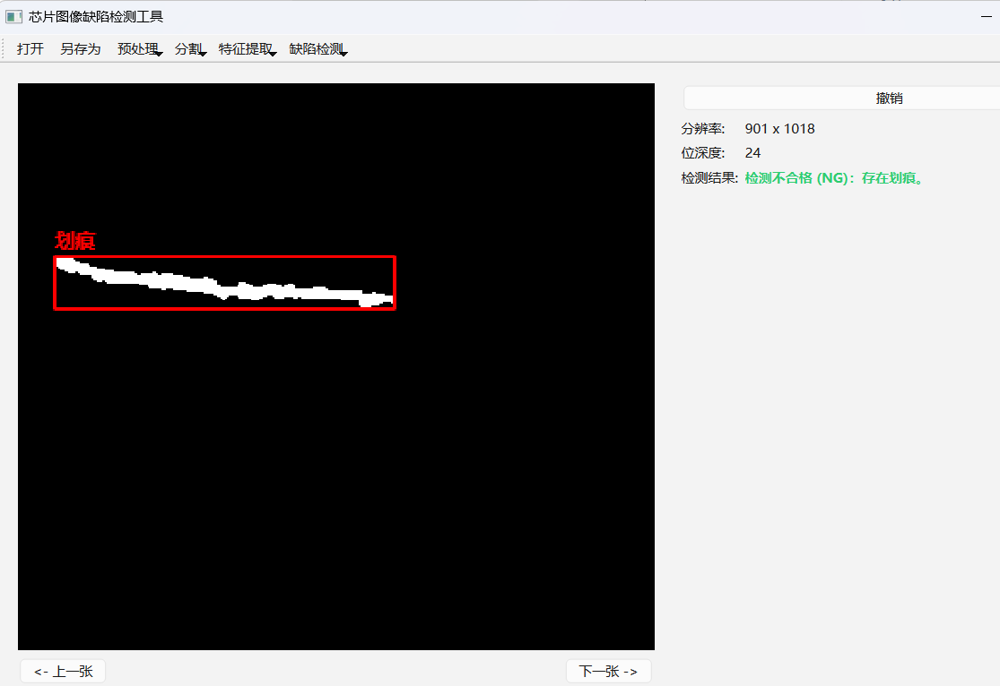

## 项目简介
    1. 用途：本科毕业设计，备份
    2. 名称：芯片缺陷检测算法设计及实现
    3. 原理：数字图像处理。通过待测图和标准图对比，检测出待测图中的芯片缺陷
## 如何使用
    1. 安装Qt Creator，打开此项目，构建套件选择Qt Creator自带的（如：Desktop Qt 6.10.1 MinGW 64-bit）
        先构建，再运行
    2. 运行成功，点击“打开”，导入待测图像文件夹，开始检测
    3. 检测流程：在缺陷检测工具栏内。模板匹配、阈值分割、连通域分析、图像差分、连通域分析、缺陷分析
## 文件目录结构
+ project
    + data
        + bottom
            + defect
            + standard
        + top
            + defect
            + standard
    + include
    + src
    + CMakeLists.txt
    + build
    + (others...)
## 注意事项
    standard 文件夹只存放一张标准图像
## 运行效果
    

